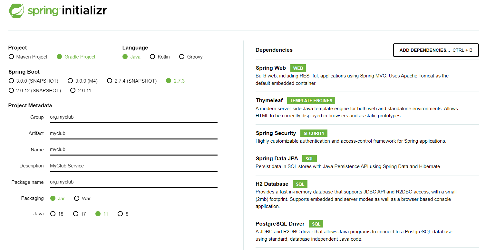

# 2. 프로젝트만들기

## 2.1  start.spring.io


```
Spring Boot DevTools
Lombok 
Spring Configuration Processor 
Spring Web
Thymeleaf
Spring Security
Spring Data JPA 
H2 Database
PostgreSQL Driver
```

## 2.2 gradle import
 * File > Import > Gradle > Existing Gradle Project
 * Project root directory :  build.gradle's parent's folder  

# 3. Account Domain
org.myclub.domain.Account  

* @EqualsAndHashCode(of = "id")  
  => 확인하자 ===========

# 4.  회원가입  Controller
## 4.1 SecurityConfig.java
* WebSecurityConfigurerAdapter  없어짐
* 아래와 같이 변경  
Spring Security without the WebSecurityConfigurerAdapter  
https://spring.io/blog/2022/02/21/spring-security-without-the-websecurityconfigureradapter


```java
@Configuration
@EnableWebSecurity
public class SecurityConfig {

    @Bean
    SecurityFilterChain securityFilterChain(HttpSecurity http) throws Exception {
        // @formatter:off
        return http.authorizeRequests()
                .mvcMatchers("/", "/login", "/sign-up", "/check-email", "/check-email-token",
                        "/email-login", "/check-email-login", "login-link", "/profile/*").permitAll()
                .mvcMatchers(HttpMethod.GET, "/profile/*").permitAll()
                .anyRequest().authenticated()
                .and()
                .formLogin().loginPage("/login").permitAll()
                .and()
                .logout().logoutSuccessUrl("/")
                .and().build();
        // @formatter:on
    }

    @Bean
    WebSecurityCustomizer webSecurityCustomizer() {
      return (web) -> web.ignoring().mvcMatchers("/node_modules/**")
          .requestMatchers(PathRequest.toStaticResources().atCommonLocations());
    }
}
```

## 4.2 MoreUnit 설정
* Eclipse Marketplace 에서 추가
* https://blog.outsider.ne.kr/657
* ctrl + j : test class 생성 (junit5 선택)
* ctrl + r : test
  
```java
package org.myclub.account;

import org.junit.jupiter.api.DisplayName;
import org.junit.jupiter.api.Test;
import org.springframework.beans.factory.annotation.Autowired;
import org.springframework.boot.test.autoconfigure.web.servlet.AutoConfigureMockMvc;
import org.springframework.boot.test.context.SpringBootTest;
import org.springframework.test.web.servlet.MockMvc;
import static org.springframework.test.web.servlet.request.MockMvcRequestBuilders.get;
import static org.springframework.test.web.servlet.result.MockMvcResultHandlers.print;
import static org.springframework.test.web.servlet.result.MockMvcResultMatchers.status;
import static org.springframework.test.web.servlet.result.MockMvcResultMatchers.view;
@SpringBootTest
@AutoConfigureMockMvc
public class AccountControllerTest {

	@Autowired
	private MockMvc mockMvc;

	@DisplayName("회원 가입 화면 보이는지 테스트")
	@Test
	void signUpForm() throws Exception {
		mockMvc.perform(get("/sign-up")).andDo(print()).andExpect(status().isOk())
				.andExpect(view().name("account/sign-up"));
	}
}
```

# 5.  회원가입  View

* spring devltools :  재시작 없이 화면 반영
* css 는 rendering  전, script는  rendering  후
* thymeleaf @  경로 
* th:object="${signUpForm}  : * 로 참조 field (value, name)
* needs-validation :  화면단 검증
* model.AddAttribute("signUpForm", new SignUpForm), model.AddAttribute(new SignUpForm) 동일 의미

```html
<!DOCTYPE html>
<html lang="en" xmlns:th="http://www.thymeleaf.org">

<head>
	<meta charset="UTF-8">
	<title>My Club</title>
	<link href="https://cdn.jsdelivr.net/npm/bootstrap@5.2.0/dist/css/bootstrap.min.css" rel="stylesheet"
		integrity="sha384-gH2yIJqKdNHPEq0n4Mqa/HGKIhSkIHeL5AyhkYV8i59U5AR6csBvApHHNl/vI1Bx" crossorigin="anonymous">
	<style>
		.container {
			max-width: 100%;
		}
	</style>
</head>

<body class="bg-light">
	<nav class="navbar navbar-expand-sm navbar-dark bg-dark">
		<a class="navbar-brand" href="/" th:href="@{/}">
			
		</a>
		<button class="navbar-toggler" type="button" data-toggle="collapse" data-target="#navbarSupportedContent"
			aria-controls="navbarSupportedContent" aria-expanded="false" aria-label="Toggle navigation">
			<span class="navbar-toggler-icon"></span>
		</button>

		<div class="collapse navbar-collapse" id="navbarSupportedContent">
			<ul class="navbar-nav me-auto">
				<li class="nav-item">
					<form th:action="@{/search/study}" class="form-inline" method="get">
						<input class="form-control mr-sm-2" name="keyword" type="search" placeholder="스터디 찾기"
							aria-label="Search" />
					</form>
				</li>
			</ul>

			<ul class="navbar-nav justify-content-end">
				<li class="nav-item">
					<a class="nav-link" href="#" th:href="@{/login}">로그인</a>
				</li>
				<li class="nav-item">
					<a class="nav-link" href="#" th:href="@{/signup}">가입</a>
				</li>
			</ul>
		</div>
	</nav>

	<div class="container">
		<div class="py-5 text-center">
			<h2>계정 만들기</h2>
		</div>
		<div class="row justify-content-center">
			<form class="needs-validation col-sm-6" action="#" th:action="@{/signup}" th:object="${signUpForm}"
				method="post" novalidate>
				<div class="form-group">
					<label for="nickname">닉네임</label>
					<input id="nickname" type="text" th:field="*{nickname}" class="form-control" placeholder="whiteship"
						aria-describedby="nicknameHelp" required minlength="3" maxlength="20">
					<small id="nicknameHelp" class="form-text text-muted">
						공백없이 문자와 숫자로만 3자 이상 20자 이내로 입력하세요. 가입후에 변경할 수 있습니다.
					</small>
					<small class="invalid-feedback">닉네임을 입력하세요.</small>
					<small class="form-text text-danger" th:if="${#fields.hasErrors('nickname')}"
						th:errors="*{nickname}">Nickname Error</small>
				</div>

				<div class="form-group">
					<label for="email">이메일</label>
					<input id="email" type="email" th:field="*{email}" class="form-control" placeholder="your@email.com"
						aria-describedby="emailHelp" required>
					<small id="emailHelp" class="form-text text-muted">
						스터디올래는 사용자의 이메일을 공개하지 않습니다.
					</small>
					<small class="invalid-feedback">이메일을 입력하세요.</small>
					<small class="form-text text-danger" th:if="${#fields.hasErrors('email')}"
						th:errors="*{email}">Email Error</small>
				</div>

				<div class="form-group">
					<label for="password">패스워드</label>
					<input id="password" type="password" th:field="*{password}" class="form-control"
						aria-describedby="passwordHelp" required minlength="8" maxlength="50">
					<small id="passwordHelp" class="form-text text-muted">
						8자 이상 50자 이내로 입력하세요. 영문자, 숫자, 특수기호를 사용할 수 있으며 공백은 사용할 수 없습니다.
					</small>
					<small class="invalid-feedback">패스워드를 입력하세요.</small>
					<small class="form-text text-danger" th:if="${#fields.hasErrors('password')}"
						th:errors="*{password}">Password Error</small>
				</div>

				<div class="row">
					<button class="btn btn-primary btn-block" type="submit" aria-describedby="submitHelp">가입하기</button>
					<small id="submitHelp" class="form-text text-muted">
						<a href="#">약관</a>에 동의하시면 가입하기 버튼을 클릭하세요.
					</small>
				</div>
			</form>
		</div>

		<footer th:fragment="footer">
			<div class="d-flex justify-content-center">
				
				<small class="d-block mb-3 text-muted">&copy; 2022</small>
			</div>
		</footer>
	</div>

	<script src="https://cdn.jsdelivr.net/npm/@popperjs/core@2.11.5/dist/umd/popper.min.js"
		integrity="sha384-Xe+8cL9oJa6tN/veChSP7q+mnSPaj5Bcu9mPX5F5xIGE0DVittaqT5lorf0EI7Vk"
		crossorigin="anonymous"></script>
	<script src="https://cdn.jsdelivr.net/npm/bootstrap@5.2.0/dist/js/bootstrap.min.js"
		integrity="sha384-ODmDIVzN+pFdexxHEHFBQH3/9/vQ9uori45z4JjnFsRydbmQbmL5t1tQ0culUzyK"
		crossorigin="anonymous"></script>

	<script type="application/javascript">
		(function () {
			'use strict';

			window.addEventListener('load', function () {
				// Fetch all the forms we want to apply custom Bootstrap validation styles to
				var forms = document.getElementsByClassName('needs-validation');

				// Loop over them and prevent submission
				Array.prototype.filter.call(forms, function (form) {
					form.addEventListener('submit', function (event) {
						if (form.checkValidity() === false) {
							event.preventDefault();
							event.stopPropagation();
						}
						form.classList.add('was-validated')
					}, false)
				})
			}, false)
		}())
	</script>
</body>

</html>
```
 
