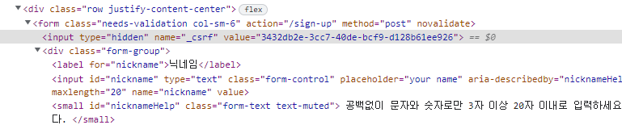

# 2. 프로젝트만들기

## 2.1  start.spring.io


```
Spring Boot DevTools
Lombok 
Spring Configuration Processor 
Spring Web
Thymeleaf
Spring Security
Spring Data JPA 
H2 Database
PostgreSQL Driver
Java Mail Sender
Validation 
```

## 2.2 gradle import
 * File > Import > Gradle > Existing Gradle Project
 * Project root directory :  build.gradle's parent's folder  

## 2.3 build.gradle
```gradle 
plugins {
	id 'org.springframework.boot' version '2.7.3'
	id 'io.spring.dependency-management' version '1.0.13.RELEASE'
	id 'java'
	id 'com.github.node-gradle.node' version "3.1.1" // npm plugin
}

group = 'org.myclub'
version = '0.0.1-SNAPSHOT'
sourceCompatibility = '11'

configurations {
	compileOnly {
		extendsFrom annotationProcessor
	}
}

repositories {
	mavenCentral()
	gradlePluginPortal() // https://plugins.gradle.org/m2/
}

dependencies {
	implementation 'org.springframework.boot:spring-boot-starter-data-jpa'
	implementation 'org.springframework.boot:spring-boot-starter-security'
	implementation 'org.springframework.boot:spring-boot-starter-thymeleaf'
	implementation 'org.springframework.boot:spring-boot-starter-web'
	implementation 'org.thymeleaf.extras:thymeleaf-extras-springsecurity5'
	compileOnly 'org.projectlombok:lombok'
	developmentOnly 'org.springframework.boot:spring-boot-devtools'
	runtimeOnly 'com.h2database:h2'
	runtimeOnly 'org.postgresql:postgresql'
	annotationProcessor 'org.springframework.boot:spring-boot-configuration-processor'
	annotationProcessor 'org.projectlombok:lombok'
	testImplementation 'org.springframework.boot:spring-boot-starter-test'
	implementation 'org.springframework.boot:spring-boot-starter-mail'
	testImplementation 'org.springframework.security:spring-security-test'
	implementation 'org.springframework.boot:spring-boot-starter-validation'
	implementation 'com.github.node-gradle:gradle-node-plugin:3.1.1'  // npm
}

tasks.named('test') {
	useJUnitPlatform()
}


//npm start
node {
   version = '16.3.0'
   download = true
   nodeModulesDir = file("${projectDir}/src/main/resources/static")

}
task copyFrontLib(type: Copy) {
   from "${projectDir}/src/main/resources/static"
   into "${projectDir}/build/resources/main/static/."
}
copyFrontLib.dependsOn npmInstall
compileJava.dependsOn copyFrontLib
//npm start
```

# 3. Account Domain
org.myclub.domain.account  

* @EqualsAndHashCode(of = "id")  
  => 확인하자 ===========

# 4.  회원가입  Controller
## 4.1 SecurityConfig.java
* WebSecurityConfigurerAdapter  없어짐
* 아래와 같이 변경  
Spring Security without the WebSecurityConfigurerAdapter  
https://spring.io/blog/2022/02/21/spring-security-without-the-websecurityconfigureradapter


```java
@Configuration
@EnableWebSecurity
@RequiredArgsConstructor
public class SecurityConfig {
	@Bean
	SecurityFilterChain securityFilterChain(HttpSecurity http) throws Exception {
		// @formatter:off
        return http.authorizeRequests()
                .mvcMatchers("/", "/login", "/sign-up", "/check-email-token",
                        "/email-login", "/check-email-login", "login-link").permitAll()
                .mvcMatchers(HttpMethod.GET, "/profile/*").permitAll()
                .anyRequest().authenticated()
                .and()
                .formLogin().loginPage("/login").permitAll()
                .and()
                .logout().logoutSuccessUrl("/")
                .and().build();
        // @formatter:on
	}

	@Bean
	WebSecurityCustomizer webSecurityCustomizer() {
		return (web) -> web.ignoring().mvcMatchers("/node_modules/**")
				.requestMatchers(PathRequest.toStaticResources().atCommonLocations());
	}
}

```

## 4.2 MoreUnit 설정
* Eclipse Marketplace 에서 추가
* https://blog.outsider.ne.kr/657
* ctrl + j : test class 생성 (junit5 선택)
* ctrl + r : test
* ctrl + alt + shift + r : method test
  
```java
package org.myclub.account;

import org.junit.jupiter.api.DisplayName;
import org.junit.jupiter.api.Test;
import org.springframework.beans.factory.annotation.Autowired;
import org.springframework.boot.test.autoconfigure.web.servlet.AutoConfigureMockMvc;
import org.springframework.boot.test.context.SpringBootTest;
import org.springframework.test.web.servlet.MockMvc;
import static org.springframework.test.web.servlet.request.MockMvcRequestBuilders.get;
import static org.springframework.test.web.servlet.result.MockMvcResultHandlers.print;
import static org.springframework.test.web.servlet.result.MockMvcResultMatchers.status;
import static org.springframework.test.web.servlet.result.MockMvcResultMatchers.view;
@SpringBootTest
@AutoConfigureMockMvc
public class AccountControllerTest {

	@Autowired
	private MockMvc mockMvc;

	@DisplayName("회원 가입 화면 보이는지 테스트")
	@Test
	void signUpForm() throws Exception {
		mockMvc.perform(get("/sign-up")).andDo(print()).andExpect(status().isOk())
				.andExpect(view().name("account/sign-up"));
	}
}
```

# 5.  회원가입 : View

* spring devltools :  재시작 없이 화면 반영
* css 는 rendering  전, script는  rendering  후
* thymeleaf @  경로 
* th:object="${signUpForm}  : * 로 참조 field (value, name)
* needs-validation :  화면단 검증
* model.AddAttribute("signUpForm", new SignUpForm), model.AddAttribute(new SignUpForm) 동일 의미

```html
<!DOCTYPE html>
<html lang="en" xmlns:th="http://www.thymeleaf.org">

<head>
	<meta charset="UTF-8">
	<title>My Club</title>
	<link href="https://cdn.jsdelivr.net/npm/bootstrap@5.2.0/dist/css/bootstrap.min.css" rel="stylesheet"
		integrity="sha384-gH2yIJqKdNHPEq0n4Mqa/HGKIhSkIHeL5AyhkYV8i59U5AR6csBvApHHNl/vI1Bx" crossorigin="anonymous">
	<style>
		.container {
			max-width: 100%;
		}
	</style>
</head>

<body class="bg-light">
	<nav class="navbar navbar-expand-sm navbar-dark bg-dark">
		<a class="navbar-brand" href="/" th:href="@{/}">
			
		</a>
		<button class="navbar-toggler" type="button" data-toggle="collapse" data-target="#navbarSupportedContent"
			aria-controls="navbarSupportedContent" aria-expanded="false" aria-label="Toggle navigation">
			<span class="navbar-toggler-icon"></span>
		</button>

		<div class="collapse navbar-collapse" id="navbarSupportedContent">
			<ul class="navbar-nav me-auto">
				<li class="nav-item">
					<form th:action="@{/search/study}" class="form-inline" method="get">
						<input class="form-control mr-sm-2" name="keyword" type="search" placeholder="스터디 찾기"
							aria-label="Search" />
					</form>
				</li>
			</ul>

			<ul class="navbar-nav justify-content-end">
				<li class="nav-item">
					<a class="nav-link" href="#" th:href="@{/login}">로그인</a>
				</li>
				<li class="nav-item">
					<a class="nav-link" href="#" th:href="@{/signup}">가입</a>
				</li>
			</ul>
		</div>
	</nav>

	<div class="container">
		<div class="py-5 text-center">
			<h2>계정 만들기</h2>
		</div>
		<div class="row justify-content-center">
			<form class="needs-validation col-sm-6" action="#" th:action="@{/sign-up}" th:object="${signUpForm}"
				method="post" novalidate>
				<div class="form-group">
					<label for="nickname">닉네임</label>
					<input id="nickname" type="text" th:field="*{nickname}" class="form-control" placeholder="your name"
						aria-describedby="nicknameHelp" required minlength="3" maxlength="20">
					<small id="nicknameHelp" class="form-text text-muted">
						공백없이 문자와 숫자로만 3자 이상 20자 이내로 입력하세요. 가입후에 변경할 수 있습니다.
					</small>
					<small class="invalid-feedback">닉네임을 입력하세요.</small>
					<small class="form-text text-danger" th:if="${#fields.hasErrors('nickname')}"
						th:errors="*{nickname}">Nickname Error</small>
				</div>

				<div class="form-group">
					<label for="email">이메일</label>
					<input id="email" type="email" th:field="*{email}" class="form-control" placeholder="your@email.com"
						aria-describedby="emailHelp" required>
					<small id="emailHelp" class="form-text text-muted">
						스터디올래는 사용자의 이메일을 공개하지 않습니다.
					</small>
					<small class="invalid-feedback">이메일을 입력하세요.</small>
					<small class="form-text text-danger" th:if="${#fields.hasErrors('email')}"
						th:errors="*{email}">Email Error</small>
				</div>

				<div class="form-group">
					<label for="password">패스워드</label>
					<input id="password" type="password" th:field="*{password}" class="form-control"
						aria-describedby="passwordHelp" required minlength="8" maxlength="50">
					<small id="passwordHelp" class="form-text text-muted">
						8자 이상 50자 이내로 입력하세요. 영문자, 숫자, 특수기호를 사용할 수 있으며 공백은 사용할 수 없습니다.
					</small>
					<small class="invalid-feedback">패스워드를 입력하세요.</small>
					<small class="form-text text-danger" th:if="${#fields.hasErrors('password')}"
						th:errors="*{password}">Password Error</small>
				</div>

				<div class="row">
					<button class="btn btn-primary btn-block" type="submit" aria-describedby="submitHelp">가입하기</button>
					<small id="submitHelp" class="form-text text-muted">
						<a href="#">약관</a>에 동의하시면 가입하기 버튼을 클릭하세요.
					</small>
				</div>
			</form>
		</div>

		<footer th:fragment="footer">
			<div class="d-flex justify-content-center">
				
				<small class="d-block mb-3 text-muted">&copy; 2022</small>
			</div>
		</footer>
	</div>

	<script src="https://cdn.jsdelivr.net/npm/@popperjs/core@2.11.5/dist/umd/popper.min.js"
		integrity="sha384-Xe+8cL9oJa6tN/veChSP7q+mnSPaj5Bcu9mPX5F5xIGE0DVittaqT5lorf0EI7Vk"
		crossorigin="anonymous"></script>
	<script src="https://cdn.jsdelivr.net/npm/bootstrap@5.2.0/dist/js/bootstrap.min.js"
		integrity="sha384-ODmDIVzN+pFdexxHEHFBQH3/9/vQ9uori45z4JjnFsRydbmQbmL5t1tQ0culUzyK"
		crossorigin="anonymous"></script>

	<script type="application/javascript">
		(function () {
			'use strict';

			window.addEventListener('load', function () {
				// Fetch all the forms we want to apply custom Bootstrap validation styles to
				var forms = document.getElementsByClassName('needs-validation');

				// Loop over them and prevent submission
				Array.prototype.filter.call(forms, function (form) {
					form.addEventListener('submit', function (event) {
						if (form.checkValidity() === false) {
							event.preventDefault();
							event.stopPropagation();
						}
						form.classList.add('was-validated')
					}, false)
				})
			}, false)
		}())
	</script>
</body>

</html>
```
# 6.  회원가입 : Form, Submit 검증

## 6.1 profile 적용
```java
@Profile("local")
@Component
@Slf4j
public class ConsoleMailSender implements JavaMailSender {  
 
  @Override
	public void send(SimpleMailMessage simpleMailMessage) throws MailException {
		log.info(simpleMailMessage.getText());
	}  

  //other code
}
```

applicaton.properties
```properties
spring.profiles.active=local
```

## 6.2 validator  적용 (Custom  검증)
```java
@Component
@RequiredArgsConstructor
public class SignUpFormValidator implements Validator {

    private final AccountRepository accountRepository;

    @Override
    public boolean supports(Class<?> aClass) {
        return aClass.isAssignableFrom(SignUpForm.class);
    }

    @Override
    public void validate(Object object, Errors errors) {
        SignUpForm signUpForm = (SignUpForm)object;
        if (accountRepository.existsByEmail(signUpForm.getEmail())) {
            errors.rejectValue("email", "invalid.email", new Object[]{signUpForm.getEmail()}, "이미 사용중인 이메일입니다.");
        }

        if (accountRepository.existsByNickname(signUpForm.getNickname())) {
            errors.rejectValue("nickname", "invalid.nickname", new Object[]{signUpForm.getEmail()}, "이미 사용중인 닉네임입니다.");
        }
    }
}
```

``` java
@Controller
@RequiredArgsConstructor
public class AccountController {

    private final SignUpFormValidator signUpFormValidator;
    private final AccountRepository accountRepository;
    private final JavaMailSender javaMailSender;

    @InitBinder("signUpForm")
    public void initBinder(WebDataBinder webDataBinder) {
        webDataBinder.addValidators(signUpFormValidator);
    }

    @GetMapping("/sign-up")
    public String signUpForm(Model model) {
        model.addAttribute(new SignUpForm());
        return "account/sign-up";
    }

    @PostMapping("/sign-up")
    public String signUpSubmit(@Valid SignUpForm signUpForm, Errors errors) {
        if (errors.hasErrors()) {
            return "account/sign-up";
        }

        Account account = Account.builder()
                .email(signUpForm.getEmail())
                .nickname(signUpForm.getNickname())
                .password(signUpForm.getPassword()) // TODO encoding 해야함
                .studyCreatedByWeb(true)
                .studyEnrollmentResultByWeb(true)
                .studyUpdatedByWeb(true)
                .build();
        Account newAccount = accountRepository.save(account);
        newAccount.generateEmailCheckToken();
        SimpleMailMessage mailMessage = new SimpleMailMessage();
        mailMessage.setTo(newAccount.getEmail());
        mailMessage.setSubject("My Club, 회원 가입 인증");
        mailMessage.setText("/check-email-token?token=" + newAccount.getEmailCheckToken() +
                "&email=" + newAccount.getEmail());
        javaMailSender.send(mailMessage);

        return "redirect:/";
    }

}
/*
1. @RequiredArgsConstructor 
 private filanl 변수는 생성자를 직접 만들어 줌 (private는 안만들어 줌)
 bean 생성자 1개만 있고, 생성자가 받는 파라미터가 빈으로 등록되어 있다면 
 spring 4.2  이후 자동 주입  (autowire  or inject 불필요)

2. public String signUpSubmit(@Valid SignUpForm signUpForm, Errors errors) 
   @ModelAttribute (@Valid  옆)  :  복합객체의 경우 생략
*/    
```

## 6.3 SignUpForm  적용
(공항에서 여권확인)
```java
@Data
public class SignUpForm {

    @NotBlank
    @Length(min = 3, max = 20)
    @Pattern(regexp = "^[ㄱ-ㅎ가-힣a-z0-9_-]{3,20}$")
    private String nickname;

    @Email
    @NotBlank
    private String email;

    @NotBlank
    @Length(min = 8, max = 50)
    private String password;

}


```

# 7.  회원가입 : Form, Submit 처리
(#6  참고)

# 8. 회원가입 :  Refactoroing & Test
* csrf 설정
```java
void signUpSubmit_with_wrong_input() throws Exception {
  // @formatter:off
      mockMvc.perform(post("/sign-up")
              .param("nickname", "keesun")
              .param("email", "email..")
              .param("password", "12345")
              .with(csrf()))
              .andExpect(status().isOk())
              .andExpect(view().name("account/sign-up"));
      // @formatter:on
}
```
sign-up.html  


# 9. Password Encoder
* hashing 알고리즘 (단방향)
* salt : 비밀번호 + salt => hash  값 (dictionary attack 방지)

```java
@Configuration
public class AppConfig {

	@Bean
	PasswordEncoder passwordEncoder() {
		return PasswordEncoderFactories.createDelegatingPasswordEncoder();
	}
}
```

* AccountService
```java
@Service
@RequiredArgsConstructor
public class AccountService {
	////
    private final PasswordEncoder passwordEncoder;

    private Account saveNewAccount(@Valid SignUpForm signUpForm) {
        Account account = Account.builder()
                .email(signUpForm.getEmail())
                .nickname(signUpForm.getNickname())
                .password(passwordEncoder.encode(signUpForm.getPassword()))
                .studyCreatedByWeb(true)
                .studyEnrollmentResultByWeb(true)
                .studyUpdatedByWeb(true)
                .build();
        return accountRepository.save(account);
    }
	////
}
```


# 10.  회원가입 : 인증  mail  확인
* repository  (현 프로젝트 기준)  
  domain 과 동일 level 로 보고 여러 곳에서 참조  
  대신 service/controller는  repository/domain 에서 참조 안한다.

* Transactional 
```java
public class AccountService {
	////
	@Transactional
	public void processNewAccount(SignUpForm signUpForm) {
		Account newAccount = saveNewAccount(signUpForm);
		newAccount.generateEmailCheckToken();
		sendSignUpConfirmEmail(newAccount);
	}
	////
}
```

# 11.  회원가입 : refactoring
@Transactional  
Test 에서도 @Transactional 

```java
@Transactional
@SpringBootTest
@AutoConfigureMockMvc
class AccountControllerTest {
	////
	@DisplayName("인증 메일 확인 - 입력값 정상")
	@Test
	void checkEmailToken() throws Exception {
		// @formatter:off
        Account account = Account.builder()
                .email("test@email.com")
                .password("12345678")
                .nickname("keesun")
                .build();
        // @formatter:on
		Account newAccount = accountRepository.save(account);
		newAccount.generateEmailCheckToken();

		// @formatter:off
        mockMvc.perform(get("/check-email-token")
                .param("token", newAccount.getEmailCheckToken())
                .param("email", newAccount.getEmail()))
                .andExpect(status().isOk())
                .andExpect(model().attributeDoesNotExist("error"))
                .andExpect(model().attributeExists("nickname"))
                .andExpect(model().attributeExists("numberOfUser"))
                .andExpect(view().name("account/checked-email"));
        // @formatter:on
	}
	////
}
```

# 12. 회원 가입 : 가입 완료후 자동  login
```java
public class AccountService {
	///
	public void login(Account account) {
		// @formatter:off
        UsernamePasswordAuthenticationToken token = new UsernamePasswordAuthenticationToken(
                account.getNickname(),
                account.getPassword(),
                List.of(new SimpleGrantedAuthority("ROLE_USER")));
        // @formatter:on
		SecurityContextHolder.getContext().setAuthentication(token);
	}
	////
}	
```

* 정석적인 방법 (사용못함, 비밀번호가 encoding 되어 있어서.)
```java
public class AccountService {
    private final AuthenticationManager authenticationManager;

	public void login(Account account) {
		// @formatter:off
        UsernamePasswordAuthenticationToken token = new UsernamePasswordAuthenticationToken(
                username, password);
        // @formatter:on
        Authentication authentication = authenticationManager.authenticate(token);
		SecurityContext context = SecurityContextHolder.getContext();
		context.setAuthentication(authentication);
	}
}	
```

# 13. 회원가입 : 메인 navigation
* gradle  에서는 설정 필요 없는 듯
``` xml
<dependency>
	<groupId>org.thymeleaf.extras</groupId>
	<artifactId>thymeleaf-extras-springsecurity5</artifactId>
</dependency>
```

## 14. frontend library 
1. node.js install
2. npm install  
  build.gradle npm 관련 추가 (2.3 build.gradle  참고)  
  cd ../resoures/static  
  npm init (계속  enter, 마지막에 yes)  
3. bootstrap, jquery install  
   npm install bootstrap  (proper 는  bootstrap 에 포함)  
   npm install jquery  
   
3. gradle build
   eclipse > gradle tasks > myProject > build > build  
   (build => npm install  의미)
4. jar  파일 실행   
   cd ../build/lib/  
   java -jar xxx-x.x.1-SNAPSHOT.jar 
5. git  제외 해주기   


``` 
 (확인)
 npm build 
 mvn package
 mvnw test  
```

## 15. View 중복 제거
fragments.html
```html
<footer th:fragment="footer">
	<div class="d-flex justify-content-center">
		
		<small class="d-block mb-3 text-muted">&copy; 2022</small>
	</div>
</footer>
```

사용
```html
<head th:replace="fragments.html :: footer"> </head>
```

## 16. Update Page
font awesome, jdenticon  설치  
 * npm install font-awesome
 * npm install jdenticon
 * gradle build

https://fontawesome.com/v4/icons/  
(현재 npm 은 fontAwesome 4.x 지원 )

```html
<link rel="stylesheet" href="/node_modules/bootstrap/dist/css/bootstrap.min.css" />
<link rel="stylesheet" href="/node_modules/font-awesome/css/font-awesome.min.css" />
<script src="/node_modules/jquery/dist/jquery.min.js"></script>
<script src="/node_modules/bootstrap/dist/js/bootstrap.bundle.min.js"></script>
<script src="/node_modules/jdenticon/dist/jdenticon.min.js"></script>

//javascript 참조는 끝에 [/] 없음
```

## 17. 인증된 사용자 정보 참조
AccountService
```java
public void login(Account account) {
	// @formatter:off
	UsernamePasswordAuthenticationToken token = new UsernamePasswordAuthenticationToken(
			new UserAccount(account),  // Principal
			account.getPassword(),
			List.of(new SimpleGrantedAuthority("ROLE_USER")));
	// @formatter:on
	SecurityContextHolder.getContext().setAuthentication(token);
}
```
Spring Security 의 User  정보와 domain 의 User  정보 사이의  adaptor  
Account Property 를 들고 있는 중간 객체 필요
```java
@Getter
public class UserAccount extends User {
	private Account account;  //이름 동일
	public UserAccount(Account account) {
		super(account.getNickname(), account.getPassword(), List.of(new SimpleGrantedAuthority("ROLE_USER")));
		this.account = account;
	}
}
```

* @AuthenticationPricipal은 SpEL을 사용해서 Principal 내부 정보에 접근할 수도 있다.
```java
@Retention(RetentionPolicy.RUNTIME)
@Target(ElementType.PARAMETER)
@AuthenticationPrincipal(expression = "#this == 'anonymousUser' ? null : account")  //account  이름 동일
public @interface CurrentUser {
}
```

```java
@Controller
public class MainController {
    @GetMapping("/")
    public String home(@CurrentUser Account account, Model model) {
        if (account != null) {
            model.addAttribute(account);
        }

        return "index";
    }
}
```

## 18. 가입확인 메일
```java
@GetMapping("/resend-confirm-email")
public String resendConfirmEmail(@CurrentUser Account account, Model model) {
	if (!account.canSendConfirmEmail()) {
		model.addAttribute("error", "인증 이메일은 10초에 한번만 전송할 수 있습니다.");
		model.addAttribute("email", account.getEmail());
		return "account/check-email";
	}
	account.generateEmailCheckToken();
	accountService.sendSignUpConfirmEmail(account);
	return "redirect:/";
}
```
* redirect  
화면 fresh 할 때마다 mail 전송 되면 안됨  
form submit에서   할때와  같은 이유


## 19. 로그인 / 로그아웃

```java
@Service
@RequiredArgsConstructor
public class AccountService implements UserDetailsService {
	
	///

	@Override
	public UserDetails loadUserByUsername(String emailOrNickname) throws UsernameNotFoundException {
		Account account = accountRepository.findByEmail(emailOrNickname);
		if (account == null) {
			account = accountRepository.findByNickname(emailOrNickname);
		}
		if (account == null) {
			throw new UsernameNotFoundException(emailOrNickname);
		}
		return new UserAccount(account);	//principal
	}
}
```

```java
@Controller
public class MainController {

	@GetMapping("/")
	public String home(@CurrentUser Account account, Model model) {
		if (account != null) {
			model.addAttribute(account);
		}
		return "index";
	}

	@GetMapping("/login")
	public String login() {
		return "login";
	}
}
```

PasswordEncoder  자동 처리
```java
public class AppConfig {

	@Bean
	PasswordEncoder passwordEncoder() {
		return PasswordEncoderFactories.createDelegatingPasswordEncoder();
	}
}
```

## 20. login / logout test
```java
/*
junit5 는 아래 방식 불가
	@RequiredArgsConstructor
 	private final MockMvc mockMvc
*/

@SpringBootTest
@AutoConfigureMockMvc
class MainControllerTest {

	@Autowired
	MockMvc mockMvc;
	@Autowired
	AccountService accountService;
	@Autowired
	AccountRepository accountRepository;

	@BeforeEach
	void beforeEach() {
		// @formatter:off
        SignUpForm signUpForm = new SignUpForm();
        signUpForm.setNickname("keesun");
        signUpForm.setEmail("keesun@email.com");
        signUpForm.setPassword("12345678");
        accountService.processNewAccount(signUpForm);
        // @formatter:on
	}

	@AfterEach
	void afterEach() {
		accountRepository.deleteAll();
	}

	@DisplayName("이메일로 로그인 성공")
	@Test
	void login_with_email() throws Exception {
		// @formatter:off
        mockMvc.perform(post("/login")
                .param("username", "keesun@email.com")
                .param("password", "12345678")
                .with(csrf()))
                .andExpect(status().is3xxRedirection())
                .andExpect(redirectedUrl("/"))
                .andExpect(authenticated().withUsername("keesun"));
        // @formatter:on
	}

	@DisplayName("nickname 로그인 성공")
	@Test
	void login_with_nickname() throws Exception {
		// @formatter:off
        mockMvc.perform(post("/login")
                .param("username", "keesun")
                .param("password", "12345678")
                .with(csrf()))
                .andExpect(status().is3xxRedirection())
                .andExpect(redirectedUrl("/"))
                .andExpect(authenticated().withUsername("keesun"));
        // @formatter:on
	}

	@DisplayName("로그인 실패")
	@Test
	void login_fail() throws Exception {
		// @formatter:off
        mockMvc.perform(post("/login")
                .param("username", "111111")
                .param("password", "000000000")
                .with(csrf()))
                .andExpect(status().is3xxRedirection())
                .andExpect(redirectedUrl("/login?error"))
                .andExpect(unauthenticated());
        // @formatter:on
	}

	@WithMockUser
	@DisplayName("로그아웃")
	@Test
	void logout() throws Exception {
		// @formatter:off
        mockMvc.perform(post("/logout")
                .with(csrf()))
                .andExpect(status().is3xxRedirection())
                .andExpect(redirectedUrl("/"))
                .andExpect(unauthenticated());
        // @formatter:on
	}
}
```
